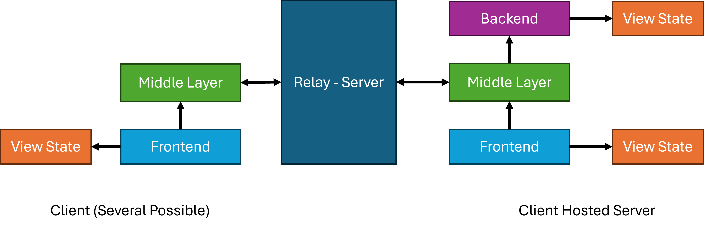

# Introduction

This project contains a multi-player game system in Rust, primarily designed for browser-based board games compiled as a WASM client. This project uses Axum/Tokio for the server, which also serves as a web server and a game-agnostic relay server. New games may even be added without
restarting the server. This is contained in the project [relay-server](#relay-server). Second, it includes a [library](#backbone-library) to construct multiplayer (browser) games on. It follows the philosophy of the client-hosted server, where clients can send a remote procedure call to the server, and the server
either sends delta updates or a whole view state to the clients. This is based on the network architecture of engines like Unity (NGO) or Unreal, though in a reduced form. The two components get interconnected
over web sockets. Shared protocol identifiers are kept in the sub-project [protocol](#protocol). As an example, a simple multiplayer game has been included in [games/tic-tac-toe](#tic-tac-toe).
You can find this system running in a more elaborate form on [Board-Game-Hub](https://board-game-hub.de).

# Why look at this project

Putting the central aspect aside, if you want to program multiplayer browser-based games, this project also contains some interesting solutions for problems I stumbled upon:

* If you are looking for a web socket app slightly more complex than the chat sample that comes with the tokio-axum project, this may be an interesting entry point.
* If you try to use web-sockets in combination with Macroquad and use quad-net, chances are, you might run into the same problems, as I did. Specifically, the version on crate.io cannot handle binary messages, and the non-WASM version also caused problems.
  The solution in [backbone-lib](#backbone-library) provides reduced WebSocket functionality that supports only binary messages, but runs in WASM and in native code.
* The sample in [games/tic-tac-toe](#tic-tac-toe) shows how to integrate egui with Macroquad and also how to fire the virtual keyboard, if the browser runs on a phone/pad. I am told that this solution does not work on Safari / Mac.
  If you have a solution for this problem, you are more than welcome to submit the correction.

In the following text, I would first like to cite some sources for JavaScript files I did not write myself, then comes a quick getting-started guide. Afterwards, the system's overall strategy is described, followed by a detailed explanation of its diverse components.

# Table of Contents

- [Foreign sources](#foreign-sources)
- [Prerequisites](#prerequisites)
- [Getting started](#getting-started)
- [General overview](#general-overview)
- [Workspace description](#workspace-description)
  - [Protocol](#protocol)
  - [Relay Server](#relay-server)
  - [Backbone Library](#backbone-library)
  - [Tic-Tac-Toe](#tic-tac-toe)
- [Creating your own game](#creating-your-own-game)
- [Production deployment](#production-deployment)
- [Known issues and limitations](#known-issues-and-limitations)
- [Contributing](#contributing)

# Foreign sources

This depot contains two JavaScript files from other projects, included here for completeness. These are:

1. **mq_js_bundle.js**: This is the macroquad bundle that is needed to run macroquad as a WASM client. The source is [here](https://not-fl3.github.io/miniquad-samples/mq_js_bundle.js).
2. **sapp_jsutils.js**: This is part of the crate sapp_jsutils to work with JavaScript objects. The source of the script is [here](https://github.com/not-fl3/sapp-jsutils/tree/master/js).

# Prerequisites

Before building this project, ensure you have the following installed:

**Rust toolchain:**
- Rust 1.90 or later (install via [rustup](https://rustup.rs/))
- The WASM target: `rustup target add wasm32-unknown-unknown`

**For Linux/MacOS:**
```bash
curl --proto '=https' --tlsv1.3 https://sh.rustup.rs -sSf | sh
rustup target add wasm32-unknown-unknown
```

**For Windows:**
- Get the installer from [rust-lang.org](https://www.rust-lang.org/tools/install)
- Then run: `rustup target add wasm32-unknown-unknown`

**Cross-compilation (optional):**
If you want to cross-compile the relay server from Windows to Linux, you need:
- [Zig](https://ziglang.org/download/) (for the linker)
- cargo-zigbuild: `cargo install cargo-zigbuild`

# Getting started

To get everything running as fast as possible, clone this repository and compile it with *BuildAll.bat* on Windows and *BuildAll.sh* on Linux. On Linux, you have to make the shell script executable upfront. Once this is done, you can start the relay server in the deploy directory. This starts a web server on port 8080. Now type <http://127.0.0.1:8080> into your favourite browser. You should see a room creation screen. Start a second browser window and do the same here, and you can play tic-tac-toe against yourself. Opening the same page in two tabs is problematic because you have to switch tabs a couple of times to send the messages.

```bash
# Linux/MacOS
chmod +x BuildAll.sh
./BuildAll.sh
cd deploy
./relay-server

# Windows
BuildAll.bat
cd deploy
relay-server.exe
```

# General overview

The overall architecture and idea of the system are sketched in the following image:



The system contains the following components:

* **Relay-Server**: This is the game agnostic server, that has functionality for room and connection management. The main services it
  provides are forwarding of remote procedure calls from clients to the server and sending partial updates and complete View State changes to clients.
* **View State**: Essentially a data structure that is controlled by the client-hosted server and sent to the clients. It may be sent entirely or as a series
  of partial updates. The client typically receives a complete update upon joining the room or when the client-hosted server decides to do so,
  which typically happens at the start of the new game. The Frontend may use partial View State updates to display transition animations.
* **Backend**: This contains the real game logic and is entirely event-based, as the system has been primarily designed for board games in mind.
  The backend resides solely on the client-hosted server side and must implement the **BackEndArchitecture** trait. The backend has an internal
  view state. All incremental changes are logged in a *BackendCommand* vector and also need to get applied to an internally administrated
  view state, which may get sent over the network if required.
* **Middle Layer**: This is the central part of the library [backbone-lib](#backbone-library). The middle layer receives requests from the front end and sends requests to the
  backend on the server side. To have a clear chain of command and to avoid any confusion with smart pointers and RefCells, the backend does
  not send any commands to the middle layer, but builds a command buffer. This buffer may get polled from the middle layer. The middle layer
  is the nexus for all the information flow in the system. It also handles new players joining the client-hosted server, providing them with a full view-state update.
* **Frontend**: This is the main program written in Macroquad, which is based on a core game loop. It has to heartbeat the middle layer, takes care
  of the initial game connection, and can send game mechanics-relevant input over an RPC. Then it can poll state changes from the middle layer to either
  hard-set the view state or perform animation transitions.

This project uses **postcard** for binary serialization to prioritize performance and message size. 
All data structures that need to be transmitted must derive `serde::Serialize` and `serde::Deserialize`.
A more specific, detailed documentation gets generated when you run *cargo doc*, which is done automatically when you run the
script in [Getting started](#Getting-started).

# Workspace description

In the following subsections, we will describe the various members of the workspace in more detail. The **BuildAll** script in
the root directory will copy the relevant compiled results and accompanying files from the diverse sources to the deploy directory as
explained in [Getting started](#getting-started).

## Protocol

This library project contains some shared definitions between the relay server and the backbone library. As every message is marked with a byte header, the meaning of those headers and, to some extent, the message sizes are encoded in constants here.
The structure **JoinRequest** contains the protocol information for a client to join a game via the relay server.

## Relay Server

When the relay server starts, it listens on port 8080. For practical deployment purposes, it is advisable to put it behind
a reverse proxy like [Caddy](https://caddyserver.com/).
The relay server loads a JSON file **GameConfig.json** on startup that contains the information on which games exist and what the
maximum number of players a room should hold. Setting this value to 0 means that there is no limitation.
A simple JSON file looks like this:

```json
[
  {
    "name" : "tic-tac-toe",
    "max_players" : 10
  }
]
```

More games may be added by extending the array. Once the server is running, the list of games may be extended during runtime.
This may be done by calling the **reload** site with the browser on the domain where the relay server is running.
The site **enlist** shows the currently active rooms.

### Server maintenance

The relay server includes a watchdog mechanism that cleans up inactive rooms every 5 minutes. Rooms without active connections are automatically removed to free resources.

The overall idea of the relay server is that two tokio tasks are servicing each connected client. The logic is split on the highest
level, whether the connection belongs to the client-hosted server or a client. These tasks refer to internal communication channels
that have been set up before in the handshake phase. These channels belong to a room (see **server_state**). This is an mpsc sender
to send messages from the clients to the client-hosted game server, and a broadcast sender the other way around. As only new clients need
a full update of the view state, this decision is taken care of in the **send_logic_client** method.

To keep the relay server as game-agnostic as possible, only connection and disconnection processing is done here. Otherwise,
it passes on information for Client to Server RPCs, where only the player ID gets attached. In the reverse direction, it can kick a player,
send partial updates, full updates, or reset. A lot of error handling and tracing is done here, with error messages sent to the clients
before closing the connection.

## Backbone Library

The backbone library contains, in its web folder, two JavaScript files that become relevant when a WASM module gets compiled.
This is the Macroquad library as mentioned [Foreign Sources](#foreign-sources) and a miniquad plugin to take care of the relevant web socket
implementation. The web socket implementation is limited here by having only one web socket at a time and by only sending and receiving
binary messages. This is handled by the file **quad_ws.js**; both files must be included in a web page that is using the compiled
WASM plugin. The remaining relevant JavaScript files and a sample web page are available in the [Tic-Tac-Toe](#tic-tac-toe) web directory.

The Rust part of the web socket implementation can be found in **web_socket_interface.rs**, where the first part of the file is
essentially abstracting over the relevant parts of the web socket functionality by using **ewebsock** in the non WASM part and
its own implementation in the WASM part. If you like to do a WebSocket implementation in a WASM context, this may be the point
to take a closer look at.
It provides communication and connection functionality, separated for the case that we are a client-hosted server or a pure
client. Sending is immediate, and receiving is on a polling basis. This should be performed in the heartbeat of the
game core loop and takes into account the fact that we can not run threads easily in a non-WASM environment.

The module **traits** contains the trait **BackEndArchitecture**, which the application must implement. The core
logical functionality of the library is contained in **middle_layer**. These are the two modules mentioned in [General Overview](#general-overview).
The **middle_layer** includes a bare-bones sample in its documentation of how a game should be structured. A more detailed
example of this can be found in the section of [Tic-Tac-Toe](#tic-tac-toe). The middle layer is essentially a
logistical one for passing messages between the frontend, the backend, and the relay server. On top of this, it interfaces
with a timer system. The timer system has been added because the backend, which has to be implemented by the game, is purely
event-driven. The timer functionality is contained in the module **timer**.

## Tic-Tac-Toe

Tic-Tac-Toe has been implemented as a minimal showcase of the system. It is also simplistic, as it does not show any transition
animations on state changes. The project comes with a template web page and two JavaScript files in the web subdirectory. These
JavaScript files are required to enable keyboard input on mobile multitouch platforms. This is **enable_keyboard.js** and
**sapp_jsutils** mentioned in [Foreign sources](#foreign-sources). These files must be combined with the compiled WebAssembly and two
JavaScript files from [Backbone Library](#backbone-library) to form a running program. The batch file [BuildAll](#getting-started) takes
care of this.

The **main** function initiates the architecture and then runs a core loop, where first the architecture gets updated,
and the connection state is queried. When we are disconnected, we want to display the logon GUI; when we are connected, we want to display the game.

The logon GUI is implemented using egui in the **gui** module. The first part, **mobile_input** with the macro **focus_textline**, is a
workaround to get the keyboard activated on mobile devices for the text_edit_singleline in egui. The idea is to redirect the input to a
hidden text field in HTML and to redirect the input from there to the single edit text line. This works only in combination with the
two JavaScript files mentioned above and the hidden textline element in the HTML page:

```html
<input type="text" id="mobile-keyboard-input"
       style="position: absolute; left: -9999px; opacity: 0;"
       autocomplete="off" />
```

This is of interest to you if you intend to use egui with WASM and want to support mobile platforms.

For the case that we are connected, we run the **update_real_game** method, which first drains the commands from the
middle layer, then renders the screen, and finally processes the input if it is our turn. The turns get processed by registering
an RPC with the middle layer. In the case of performing animations, you would stop draining commands when an animation is required,
perform the animation in the update, and continue draining commands once this is finished. The rendering of the board is done with
macroquad functionality in the **graphics** module. This whole part is what is described as the **Frontend** in
[General Overview](#general-overview).

The **View State** is implemented with the same name in **traits_implementation**. This also implements the **MoveCommand**, which is
used in the context of Tic-Tac-Toe as an **RpcPayload** and **DeltaInformation** at the same time. In more complex games, this
double function is less likely to be the case.

The module **Backend** contains the backend also mentioned in [General Overview](#general-overview). The logic is straightforward here.
Upon player arrival, we decide whether to kick the player based on the ID and whether spectators are allowed. On RPC processing, we check the move,
apply it to the local view state, and generate the delta information update. Remember, in the backend, both have to be applied.
If the game is over, we set a timer to restart it automatically. Restarting the game switches the starting player and
causes a full resync.

# Creating your own game

To create a new game using this framework, follow these steps:

## 1. Create the project structure

```
games/
└── your-game/
    ├── Cargo.toml
    ├── src/
    │   ├── main.rs
    │   ├── backend.rs
    │   ├── traits_implementation.rs
    │   ├── gui.rs
    │   └── graphics.rs
    └── web/
        └── index.html
```

## 2. Define your data structures

In `traits_implementation.rs`, define:

```rust
use serde::{Deserialize, Serialize};

// The complete game state sent to clients
#[derive(Clone, Serialize, Deserialize)]
pub struct ViewState {
    // Your game state fields
}

// Incremental updates sent to clients
#[derive(Clone, Serialize, Deserialize)]
pub struct DeltaInformation {
    // Fields describing a single change
}

// Remote procedure calls from clients to server
#[derive(Clone, Serialize, Deserialize)]
pub struct RpcPayload {
    // Player action data
}
```

## 3. Implement the BackEndArchitecture trait

In `backend.rs`:

```rust
use backbone_lib::traits::BackEndArchitecture;

pub struct Backend {
    view_state: ViewState,
    command_list: Vec<BackendCommand<DeltaInformation>>,
    // Additional state
}

impl BackEndArchitecture<RpcPayload, DeltaInformation, ViewState> for Backend {
    fn new(rule_variation: u16) -> Self { /* ... */ }
    fn player_arrival(&mut self, player_id: u16) { /* ... */ }
    fn player_departure(&mut self, player_id: u16) { /* ... */ }
    fn inform_rpc(&mut self, player_id: u16, payload: RpcPayload) { /* ... */ }
    fn timer_triggered(&mut self, timer_id: u16) { /* ... */ }
    fn get_view_state(&self) -> &ViewState  { &self.view_state }
    fn drain_commands(&mut self) -> Vec<BackendCommand<DeltaInformation>> { std::mem::take(&mut self.command_list) }
}
```

## 4. Set up the main loop

In `main.rs`:

```rust
use backbone_lib::middle_layer::MiddleLayer;

#[macroquad::main("Your Game")]
async fn main() {
    let mut net_architecture: MiddleLayer<RpcPayload, DeltaInformation, Backend, ViewState> =
         MiddleLayer::generate_middle_layer(
             "ws://127.0.0.1:8080/ws".to_string(),
             "your-game".to_string(),
        );
       loop {
         let delta_time = get_frame_time();
         net_architecture.update(delta_time);

         let state = net_architecture.connection_state().clone();
         match state {
             ConnectionState::Disconnected { error_string } => {
                     // Process startup and connecting GUI here, and start server or client eventually.
                      net_architecture
                         .start_game_server(room, 0),
             }
             ConnectionState::Connected {
                 is_server: _,
                 player_id,
                 rule_set,
             } => {
                 if let Some(update) = middle_layer.get_next_update() {
                     match update {
                         ViewStateUpdate::Full(state) => {
                             // Process hard setting of view state
                         }
                         ViewStateUpdate::Incremental(delta) => {
                             // Process any incremental information to produce animation.
                         }
                     }
                 }
                 // In the logic, we eventually create commands to be sent to the server.
                 middle_layer.register_server_rpc(command);

             }
             _ => {}
         }
         next_frame().await
     }
```

## 5. Register the game

Add your game to `GameConfig.json`:

```json
[
  {
    "name": "your-game",
    "max_players": 4
  }
]
```

## 6. Update build scripts

Add your game to `BuildAll.bat` / `BuildAll.sh` to include it in the build process.

# Production deployment

For production use, you should **not** expose the relay server directly. Instead, use a reverse proxy with SSL termination.

## Why SSL is required

Browsers require secure WebSocket connections (wss://) when the page is served over HTTPS. Without SSL, WebSocket connections will be blocked.

## Example Caddy configuration

[Caddy](https://caddyserver.com/) automatically handles SSL certificates via Let's Encrypt:

```
your-domain.com {
    # Set this path to your site's directory
    root * /usr/share/caddy

    # Route all /api/* requests to the relay server
    # This includes WebSocket connections, /api/reload, and /api/enlist
    handle_path /api/* {
        reverse_proxy localhost:8080
    }

    # Enable the static file server for HTML, JS, WASM files
    file_server
}
```

Note that the relay server endpoints (`reload`, `enlist`, WebSocket connections) are all routed through `/api/*`. Your game's JavaScript needs to connect to WebSocket via `wss://your-domain.com/api/` accordingly.

## Systemd service

Create a user axumtokio and  `/etc/systemd/system/relay-server.service`:

```ini
[Unit]
Description=Multiplayer Relay Server
After=network.target

[Service]
Environment=RUST_LOG=info
Type=simple
User=axumtokio
Group=axumtokio
WorkingDirectory=/home/axumtokio
ExecStart=/home/axumtokio/relay-server
Restart=on-failure
RestartSec=5

# Hardening
NoNewPrivileges=true
PrivateTmp=true

[Install]
WantedBy=multi-user.target
```

Then enable and start the service:

```bash
sudo systemctl enable relay-server
sudo systemctl start relay-server
```

## Firewall considerations

- Only ports 22 (SSH) and 443 (HTTPS) need to be open to the public
- Port 8080 (relay server) should only be accessible from localhost
- Port 80 is not needed if you redirect HTTP to HTTPS at the proxy level

# Known issues and limitations

## Browser tab behavior

Opening the same game in two browser tabs can cause issues because tabs share the same process and may not receive WebSocket messages promptly. **Use separate browser windows** for testing multiplayer functionality locally.

## Safari / macOS keyboard input

The virtual keyboard activation for mobile devices (used in the egui login screen) does not work correctly on Safari / macOS. The hidden input field workaround functions on iOS Safari and Android browsers but fails on desktop Safari.

If you have a solution for this, contributions are welcome!

## egui scaling on mobile

egui does not scale properly when the HTML canvas element is resized via CSS on mobile devices. The Tic-Tac-Toe example works around this by using fixed canvas dimensions, but this may not be ideal for all use cases.

## Single WebSocket limitation

The backbone library supports only one WebSocket connection at a time per client. This is by design for simplicity but may be limiting for more complex applications.

## No reconnection handling

If a client loses connection, the game is terminated. There is no automatic reconnection or state recovery mechanism. For board games, this is typically acceptable since players can simply start a new game.

# Contributing

Contributions are welcome! Here's how you can help:

## Reporting issues

- Use the [GitHub Issues](https://github.com/Carbonfreezer/multiplayer/issues) page
- Include steps to reproduce the problem
- Mention your browser, OS, and Rust version

## Submitting changes

1. Fork the repository
2. Create a feature branch: `git checkout -b feature/your-feature`
3. Make your changes
4. Run `cargo fmt` and `cargo clippy`
5. Test with both native and WASM builds
6. Submit a pull request

## Areas where help is needed

- Safari/macOS virtual keyboard fix
- Additional example games
- Documentation improvements
- Performance optimizations
- Mobile UI/UX improvements

# License

This project is licensed under the MIT License - see the [LICENSE](LICENSE) file for details.
